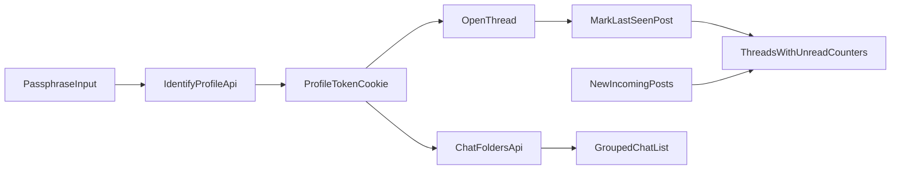
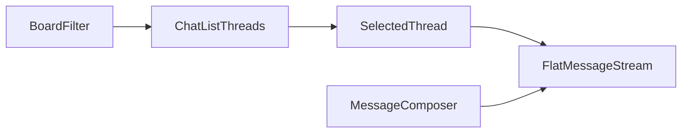

# План перехода на chat-like UI

## Цель
Сделать новый интерфейс «доски как разделы чатов, треды как чаты, посты как сообщения» и добавить анонимную серверную память пользователя для `unread counter`, без изменения базовой сущности `Post` в БД.

## Ограничение по совместимости UI
- Текущий интерфейс форума **не удаляется** и продолжает работать как есть.
- Новый chat-like интерфейс реализуется как **отдельная страница** в формате одностраничного приложения.
- Точка входа нового интерфейса: **`/chat`**.
- Интеграция должна быть additive-only: существующие маршруты `board/thread/feed` не ломаются и не переиспользуются как основной экран нового UI.

## Что уже позволяет текущая архитектура
- `thread` и `post` уже одна сущность на уровне данных (`parentId === null` для стартового сообщения треда) в [packages/backend/src/db/entities/Post.ts](packages/backend/src/db/entities/Post.ts).
- Фронт получает унифицированный тип `EpdsPost` для OP и replies в [packages/shared/src/epds.ts](packages/shared/src/epds.ts).
- Текущие роуты уже покрывают нужные сценарии: список тредов и полный тред в [packages/backend/src/api/routes/boards.ts](packages/backend/src/api/routes/boards.ts).

## Целевая UX-модель (с учетом ваших ответов)
- Десктоп: **двухпанельный интерфейс**.
  - Слева: список чатов (тредов) выбранной доски.
  - Справа: сообщения выбранного чата.
- Сообщения: **плоская хронология** без визуальной вложенности веток.
- Доски: используются как фильтр/переключатель раздела над списком чатов (не отдельная «форумная» страница с карточками тредов).
- Flow отправки: **похож на текущий**, но встроен в правую чат-панель как composer.
- Поля composer обязательны к сохранению:
  - `subject` (тема поста),
  - `poster` (автор поста),
  - `files` (вложения),
  - `message` (текст сообщения).

## Память пользователя и unread-логика (с учетом ваших ответов)
- Идентификация: **глобальный анонимный профиль** по кодовой фразе (одна фраза на все доски/треды).
- Прочтение: тред считается прочитанным **при открытии**.
- `unread counter`: считает только **чужие** новые сообщения (ваши не включаются).
- Для нового профиля: треды без истории просмотра дополнительно помечаются как **`NEW`**.
- Добавляется bulk-действие **«Прочитать всё»** для текущего раздела/списка чатов.
- Добавляется персональная функция **«Скрыть чат/тред»** с отдельным раскрываемым разделом **«Скрытые»** внизу списка.
- Добавляется персональное **переименование чатов**: alias хранится только для текущего профиля.
- Добавляется персональная **группировка чатов по папкам** (директориям) внутри доски.

## Пошаговая реализация
1. Ввести единый UI-view model `ChatMessage`/`ChatThreadItem` на фронте (без изменения backend-схемы):
   - Источник: `EpdsPost`.
   - Нормализация: OP и replies приводятся к одному формату для рендера сообщений.
   - Файлы: [packages/frontend/src/api/epds.ts](packages/frontend/src/api/epds.ts), [packages/frontend/src/components/common/PostProto/PostProto.tsx](packages/frontend/src/components/common/PostProto/PostProto.tsx), [packages/frontend/src/components/common/ThreadProto/ThreadProto.tsx](packages/frontend/src/components/common/ThreadProto/ThreadProto.tsx).

2. Собрать новый shell двухпанельного экрана чатов на отдельном роуте `/chat`:
   - Создать отдельную страницу chat-SPA с левой панелью чатов и правой панелью сообщений.
   - Переиспользовать текущие API-методы `getBoardThreads` + `getThread`, но не заменять старые board/thread страницы.
   - Файлы: новый роут в [packages/frontend/src/app](packages/frontend/src/app) + новые chat-компоненты в [packages/frontend/src/components](packages/frontend/src/components).

3. Перестроить отображение сообщений в плоский stream:
   - В правой панели рендерить OP + replies как единую хронологическую ленту (`timestamp` asc).
   - Убрать визуальный акцент «тред + вложенные ответы», оставив только чат-сообщения.
   - Файл: [packages/frontend/src/components/common/ThreadProto/ThreadProto.tsx](packages/frontend/src/components/common/ThreadProto/ThreadProto.tsx).

4. Интегрировать composer как «chat input» в правой панели:
   - Текущий `ModalPostForm` оставить как transport-слой отправки, но UI подачи сделать встроенным в чат (или обернуть текущий submit-flow в новый инпут-компонент).
   - Сохранить состав формы: `subject`, `poster`, `files`, `message` (без функциональной деградации текущего потока).
   - Визуально привести к chat-like виду: компактная «панель отправки», но с теми же полями и валидацией.
   - Сохранить текущую отправку (`PUT /v2/post/:parentId`) и post-submit refresh.
   - Файлы: [packages/frontend/src/components/common/ModalPostForm/PostForm.tsx](packages/frontend/src/components/common/ModalPostForm/PostForm.tsx), [packages/frontend/src/api/pissykaka.ts](packages/frontend/src/api/pissykaka.ts).

5. Обновить навигацию и терминологию UI:
   - «Доски» → разделы, «Треды» → чаты, «Посты» → сообщения (на уровне лейблов/заголовков).
   - Сохранить URL-структуру для обратной совместимости, но в UI показывать chat-like понятия.
   - Файлы: тексты в компонентах страниц board/thread и общих виджетах.

6. Проверка поведения и регрессий:
   - Открытие раздела: слева список чатов, справа первый/выбранный чат.
   - Отправка сообщения: появляется после refresh в текущем чате.
   - Переходы между чатами: не ломают загрузку медиа, quote-ссылки и hover preview (`/v2/post/:id`).

## Дополнительный этап: серверная память и counter новых постов
7. Добавить анонимный профиль по кодовой фразе:
   - Новый backend-слой identity: принять кодовую фразу, вычислить безопасный hash и выдать долгоживущий токен профиля (cookie/httpOnly).
   - Не хранить кодовую фразу в открытом виде.
   - Файлы: [packages/backend/src/api/routes](packages/backend/src/api/routes), [packages/backend/src/db/entities](packages/backend/src/db/entities).

8. Добавить хранение `lastSeenPostId` по треду:
   - Новая таблица/сущность вида `ThreadReadState(profileId, threadId, lastSeenPostId, seenAt)`.
   - Обновление состояния при открытии треда (mark-read-on-open).
   - Файлы: [packages/backend/src/db/entities](packages/backend/src/db/entities), [packages/backend/src/api/routes/boards.ts](packages/backend/src/api/routes/boards.ts).

9. Добавить `unreadCounter` в список чатов:
   - Для каждого треда считать количество постов с `id > lastSeenPostId` (или `timestamp > seenAt`), исключая посты текущего профиля.
   - Вернуть поле `unreadCounter` в endpoint списка тредов.
   - Файлы: [packages/backend/src/db/repositories](packages/backend/src/db/repositories), [packages/backend/src/types/responseThreadsList.ts](packages/backend/src/types/responseThreadsList.ts), [packages/shared/src/epds.ts](packages/shared/src/epds.ts), [packages/frontend/src/api/epds.ts](packages/frontend/src/api/epds.ts).

10. Показать counter в левой панели чатов:
   - В chat list рядом с тредом отрисовать бейдж `unreadCounter`.
   - При открытии чата счетчик обнуляется после успешного mark-read.
   - Файлы: [packages/frontend/src/app/board/[board_tag]/page.tsx](packages/frontend/src/app/board/[board_tag]/page.tsx) и компоненты списка тредов.

11. Добавить кнопку «Прочитать всё»:
   - В левой панели списка чатов добавить action, который массово отмечает треды как прочитанные для текущего профиля.
   - Backend endpoint выполняет bulk-update `lastSeenPostId` до текущего последнего поста каждого треда.
   - После выполнения на фронте обновляются `unreadCounter` и бейджи.
   - Файлы: [packages/backend/src/api/routes/boards.ts](packages/backend/src/api/routes/boards.ts), [packages/backend/src/db/repositories](packages/backend/src/db/repositories), [packages/frontend/src/api/epds.ts](packages/frontend/src/api/epds.ts), [packages/frontend/src/app/board/[board_tag]/page.tsx](packages/frontend/src/app/board/[board_tag]/page.tsx).

12. Добавить признак `isNewThread` для непросмотренных тредов:
   - Если для пары `profileId + threadId` отсутствует `ThreadReadState`, вернуть `isNewThread: true`.
   - На фронте показать компактный бейдж `NEW` рядом с названием чата.
   - После первого открытия треда бейдж снимается.
   - Файлы: [packages/backend/src/types/responseThreadsList.ts](packages/backend/src/types/responseThreadsList.ts), [packages/shared/src/epds.ts](packages/shared/src/epds.ts), [packages/frontend/src/api/epds.ts](packages/frontend/src/api/epds.ts), компоненты списка чатов.

13. Добавить скрытие/возврат чатов (per profile):
   - Ввести хранение состояния скрытия по паре `profileId + threadId` (например, `ThreadVisibilityState` или флаг в profile-thread таблице).
   - В основном списке показывать только не скрытые чаты.
   - Внизу списка добавить collapsible-блок «Скрытые», который по клику раскрывает скрытые чаты.
   - Для скрытых чатов оставить действие «Показать обратно» (`Unhide`).
   - Файлы: [packages/backend/src/db/entities](packages/backend/src/db/entities), [packages/backend/src/api/routes/boards.ts](packages/backend/src/api/routes/boards.ts), [packages/backend/src/types/responseThreadsList.ts](packages/backend/src/types/responseThreadsList.ts), [packages/shared/src/epds.ts](packages/shared/src/epds.ts), [packages/frontend/src/api/epds.ts](packages/frontend/src/api/epds.ts), [packages/frontend/src/app/board/[board_tag]/page.tsx](packages/frontend/src/app/board/[board_tag]/page.tsx).

14. Добавить персональные названия чатов (alias):
   - Дефолтное отображаемое название чата: `subject` первого поста (OP).
   - Если `subject` пустой или пользователь хочет своё имя чата, сохранить `alias` на уровне `profileId + threadId`.
   - В списке чатов приоритет заголовка: `alias` -> `subject OP` -> fallback (`Thread #id`).
   - Добавить действия UI: «Переименовать» и «Сбросить название».
   - Файлы: [packages/backend/src/db/entities](packages/backend/src/db/entities), [packages/backend/src/api/routes/boards.ts](packages/backend/src/api/routes/boards.ts), [packages/backend/src/types/responseThreadsList.ts](packages/backend/src/types/responseThreadsList.ts), [packages/shared/src/epds.ts](packages/shared/src/epds.ts), [packages/frontend/src/api/epds.ts](packages/frontend/src/api/epds.ts), компоненты списка чатов на странице `/chat`.

15. Добавить папки/директории чатов (per profile, per board):
   - Ввести сущности персональных папок (`folder`) и назначений тредов в папки (`folderThread`) на уровне профиля и доски.
   - Базовые операции: создать папку, переименовать, удалить (с переводом чатов в «Без папки»), назначить чат в папку, убрать из папки.
   - В UI `/chat` показывать группировку списком секций: «Без папки» + пользовательские папки; внутри секции — чаты с их `unreadCounter`, `NEW`, `hidden` статусами.
   - Для MVP сортировка папок и чатов внутри папки — по последней активности, без drag-and-drop.
   - Файлы: [packages/backend/src/db/entities](packages/backend/src/db/entities), [packages/backend/src/api/routes/boards.ts](packages/backend/src/api/routes/boards.ts), [packages/backend/src/types/responseThreadsList.ts](packages/backend/src/types/responseThreadsList.ts), [packages/shared/src/epds.ts](packages/shared/src/epds.ts), [packages/frontend/src/api/epds.ts](packages/frontend/src/api/epds.ts), компоненты списка чатов на странице `/chat`.

16. Верификация сценариев памяти:
   - Ввод кодовой фразы один раз, повторный заход узнает профиль.
   - Новые чужие посты увеличивают counter в списке.
   - Открытие треда сбрасывает counter.
   - Собственные новые сообщения counter не увеличивают.
   - Кнопка «Прочитать всё» массово обнуляет счетчики.
   - Для новых тредов без просмотра показывается `NEW`, после открытия метка исчезает.
   - Кнопка «Скрыть» убирает чат из основного списка и переносит его в блок «Скрытые».
   - Кнопка «Показать обратно» возвращает чат в основной список.
   - Переименование чата сохраняется между сессиями и видно только в текущем профиле.
   - Сброс названия возвращает дефолт (`subject OP` или fallback).
   - Создание папки и назначение чатов сохраняются между сессиями для профиля.
   - Удаление папки не удаляет чаты, а переносит их в «Без папки».

17. Верификация compose-flow в chat-like интерфейсе:
   - В composer доступны поля темы, автора, файлов и сообщения.
   - Отправка с каждым типом данных работает как в текущем flow.
   - После отправки отображение в чате корректное, без потери вложений и мета-данных поста.

18. Верификация совместимости двух интерфейсов:
   - Новый интерфейс доступен по `/chat` как отдельная страница.
   - Старые страницы форума продолжают работать без изменений поведения.
   - Оба интерфейса используют совместимые backend-контракты без регрессий.

## Риски и как закрыть
- Текущий поток `force_sync + router.refresh` дает не realtime UX: для «живого чата» позже добавить polling/SSE/WebSocket отдельным этапом.
- Старые компоненты ориентированы на imageboard-термины: нужен аккуратный слой переименования UI, чтобы не трогать backend-модель.
- Возможна нагрузка при частых переходах между чатами: стоит добавить кэш/предзагрузку активного треда на фронте отдельной задачей после базовой миграции.
- Для кодовой фразы нужна крипто-устойчивая схема (например, Argon2id/scrypt) и защита от перебора (rate limit на endpoint идентификации).
