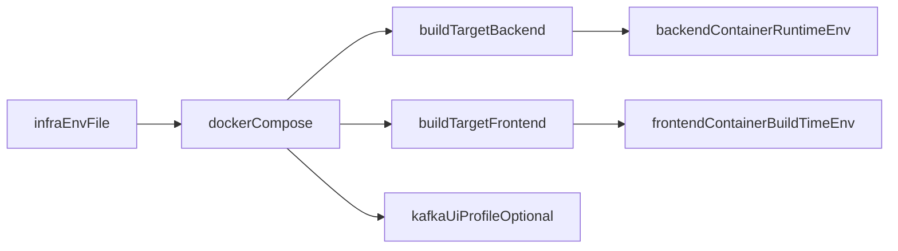

# Dockerize Monorepo Under Infra

## Цель
Сконцентрировать всю docker-инфраструктуру в `infra`, запускать `frontend`/`backend` как prod-like сервисы, и обеспечить сценарий, при котором каждый `compose up` может запускаться с чистой пересборкой (без build cache), чтобы `frontend` гарантированно подхватывал build-time env.

## Что будет добавлено
- Новый каталог `infra/monorepo-docker/` с:
  - `docker-compose.yml` (основная оркестрация)
  - `Dockerfile` (multi-stage для monorepo на `pnpm`)
  - `.env.example` (общие переменные для compose)
  - `Makefile` или `scripts/*.sh` для стандартизированного запуска с `--build --no-cache`
  - `README.md` с командами и моделью env

## Архитектура сборки и запуска
- **Multi-stage build** из корня монорепы:
  - Stage deps: установка зависимостей (`pnpm install` в workspace)
  - Stage build: сборка `shared` -> `backend` -> `frontend`
  - Runtime stages: отдельные цели для `backend` и `frontend` (минимальные runtime-образы)
- `docker-compose.yml` использует два build-target:
  - `backend` target (runtime backend)
  - `frontend` target (runtime frontend)
- `kafka-ui` из [infra/kafka-ui/docker-compose.yaml](infra/kafka-ui/docker-compose.yaml) подключается профилем (опционально, без ломки текущего сценария).

## Стратегия env (гибрид)
- Базовый env-файл: `infra/monorepo-docker/.env` (локально, из `.env.example`).
- Compose подставляет значения из базового env для build args и runtime env.
- Для сервисных override:
  - backend: поддержка `env_file`/переменных из `packages/backend/.env` (при необходимости)
  - frontend: build args для `NEXT_PUBLIC_*` из `infra/.env` + override через CLI/env file
- В README зафиксировать: `NEXT_PUBLIC_*` влияет на результат `next build`, поэтому изменения этих значений требуют rebuild.

## Гарантированная пересборка с нуля
- Основной запуск оформить как команду-обертку:
  - `docker compose up --build --force-recreate` + отдельный вариант с `docker compose build --no-cache --pull`
- Зафиксировать “чистый” сценарий как рекомендованный по умолчанию (через Make target или shell script), чтобы исключить stale cache.
- Добавить быстрый сценарий (без `--no-cache`) как опциональный, но вторичный.

## Важные места монорепы, которые учитываем
- Root workspace и скрипты: [package.json](package.json), [pnpm-workspace.yaml](pnpm-workspace.yaml)
- Backend scripts/env: [packages/backend/package.json](packages/backend/package.json), [packages/backend/.env.example](packages/backend/.env.example)
- Frontend scripts/env: [packages/frontend/package.json](packages/frontend/package.json), [packages/frontend/.env.example](packages/frontend/.env.example)
- Текущий docker-пример infra: [infra/kafka-ui/docker-compose.yaml](infra/kafka-ui/docker-compose.yaml)

## Проверка результата
- `docker compose config` проходит без ошибок.
- `backend` поднимается и видит runtime env (включая `DATABASE_URL`).
- `frontend` после clean rebuild подхватывает новые `NEXT_PUBLIC_*`.
- Повторный запуск через “clean” команду действительно пересобирает слои заново.
- Документация в `infra/monorepo-docker/README.md` покрывает onboarding (копирование `.env.example`, команды запуска, профили).
