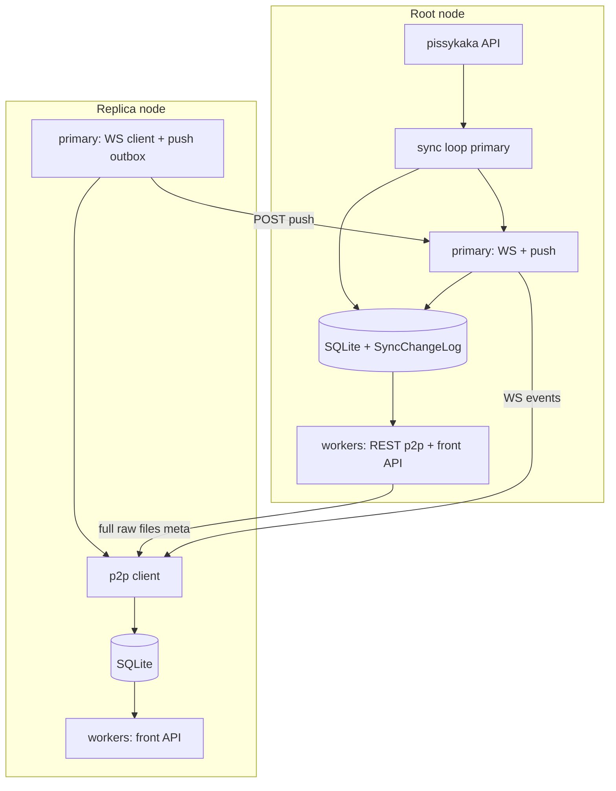
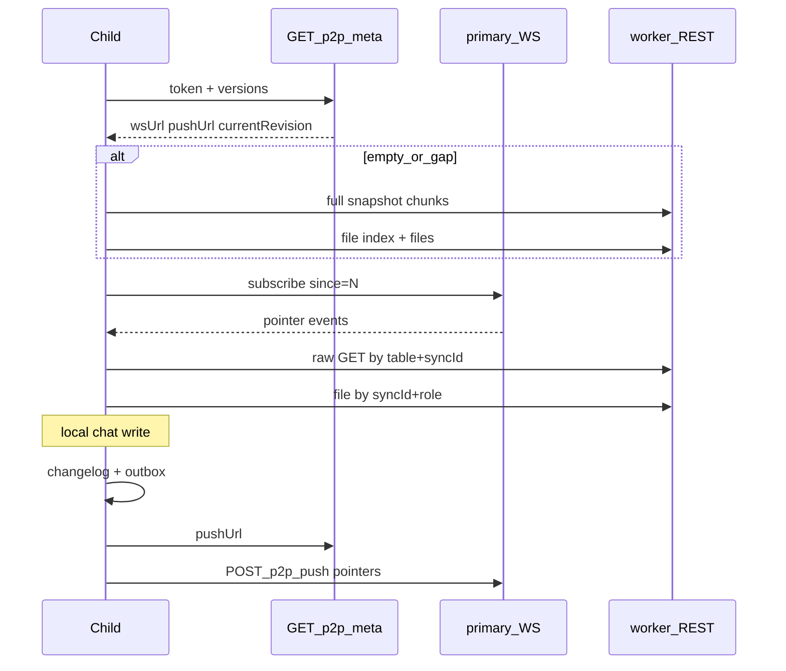

# P2P sync для epds

## Зафиксированные решения (grill-me)

- Топология: **1 upstream** (дерево); протокол готов к mesh позже
- Роль: есть `P2P_UPSTREAM_URL` → **replica** (pissykaka sync off); нет → **root**
- Версии: локальный монотонный `revision` + `originNodeId` (`P2P_NODE_ID` из env, обязательно)
- Лог: колонка `revision`/`updatedAt`/`originNodeId` на рядах + служебная **`SyncChangeLog`** без payload (не в dump, не «для всех»)
- Конфликты: **LWW** по `(updatedAt, originNodeId)`
- Скоуп репликации: `Board`, `Post`, `Media`, `ChatProfile`, `ChatFolder`, `ProfileThreadState`, `ProfileOwnPost`
- Вне скоупа: миграции, `Settings`, `SyncChangeLog`, schema-only Kafka `File`/`Passport`
- События WS / `/p2p/push` / catch-up: **только указатели** → raw GET
- Apply чужого: пишем в **свой** лог, сохраняя `originNodeId`
- Full sync: MessagePack row-chunks; apply = **upsert + LWW** (wipe только explicit repair)
- Файлы: индекс с **sha256**; скачивание `GET` по `syncId` + role; сверка hash
- Bootstrap: empty/gap (>2 дня лога) → full; иначе WS + `since=revision`
- Auth: `P2P_SYNC_TOKEN` (Bearer); заголовок готов к per-peer позже
- Schema gate: `schemaVersion` + `protocolVersion` в `/p2p/meta`
- Cluster: REST/files на **workers**; **WS + push** на **primary**; meta отдаёт `wsUrl`/`pushUrl`; локальные мутации на worker → changelog + **IPC** primary (broadcast/outbox)
- Root ingest (`processBoards`/`processPosts`): каждое изменение → changelog (+ WS если есть подписчики)

## Архитектура

## 1. Конфиг и роли узла

Файлы: [`packages/backend/src/utils/config.ts`](packages/backend/src/utils/config.ts), [`.env.example`](packages/backend/.env.example), [`packages/backend/src/app/roles.ts`](packages/backend/src/app/roles.ts), [`packages/backend/src/cluster.ts`](packages/backend/src/cluster.ts).

Новые env:

- `P2P_NODE_ID` (required если p2p server или client включён)
- `P2P_SYNC_TOKEN`
- `P2P_UPSTREAM_URL` (опционально → replica)
- `P2P_ADVERTISE_WS_URL`, `P2P_ADVERTISE_PUSH_URL` (что отдать в meta; primary реально биндится на `P2P_CONTROL_LISTEN_HOST/PORT`)
- `P2P_CONTROL_LISTEN_HOST/PORT` (primary: WS+push only)
- `P2P_PROTOCOL_VERSION` (const в коде, напр. `1`)
- `P2P_CHANGELOG_MAX_AGE_DAYS=2`
- `P2P_CHANGELOG_MAX_ROWS` (предохранитель, дефолт например `500000`)

Поведение:

- **Root:** `runSyncLoop` как сейчас на pissykaka; поднимает p2p **server** (workers + control на primary).
- **Replica:** pissykaka sync **не** запускать; вместо этого `runP2pClient(upstream)`; свой p2p server тоже поднять (чтобы у реплики могли быть children).

Локальные курсоры в **`Settings`** (не реплицируется): `p2p.lastUpstreamRevision`, `p2p.lastPushedRevision`, при необходимости `p2p.fullSyncAt`.

## 2. Схема БД

Новая миграция `1700000000007-P2pReplication.ts` (+ правки entities в [`packages/backend/src/db/entities/`](packages/backend/src/db/entities/)).

### 2.1 Служебный лог

Таблица `SyncChangeLog` (только локально):

- `revision` INTEGER PK AUTOINCREMENT (или INTEGER PK = revision)
- `tableName` TEXT
- `recordKey` TEXT (для Board/Post — stringified bigint id; для chat/media — `syncId`)
- `op` TEXT (`upsert` | `delete`)
- `originNodeId` TEXT
- `updatedAt` INTEGER
- `createdAt` INTEGER (время записи в лог)
- индексы: `(createdAt)`, `(tableName, recordKey)`

Retention job: удалять `createdAt < now - 2d` и/или сверх `MAX_ROWS` (старые сверху).

### 2.2 Колонки на реплицируемых таблицах

На **всех** реплицируемых entity:

- `revision` INTEGER NOT NULL DEFAULT 0
- `originNodeId` TEXT NULL (null = legacy/local until first write)
- `updatedAt` INTEGER — добавить там, где нет (**Board**, **Media**; chat уже имеет)

На **Media + все Chat\***:

- `syncId` TEXT NOT NULL UNIQUE — UUID v4 при insert

Локальные integer PK и FK **сохраняем**. Репликационный ключ = `syncId`. При apply remote: upsert by `syncId`, локальные FK (`profileId`, `folderId`, …) резолвятся через lookup `syncId → local id` (в raw payload слать **syncId ссылок**, не int).

Board/Post: репликационный ключ = существующий bigint `id` (внешний).

### 2.3 Media: сломать delete-all

Сейчас [`syncPostsAndMedia`](packages/backend/src/db/repositories/posts.ts) делает `DELETE Media WHERE postId IN (...)` + insert — это убивает стабильный `syncId`/hash.

Переписать на:

- стабильный `syncId` (или детерминированный UUID от `(postId, role, urlOrigin)` на root при первом появлении, далее неизменен)
- upsert media by `syncId`
- удаление только отсутствующих в новом наборе → запись `op=delete` в changelog + unlink файлов

Добавить на Media: `contentSha256`, `previewSha256` (nullable до первого хеша), считать при download/serve index.

## 3. Ядро записи изменений: `ReplicationJournal`

Новый модуль примерно `packages/backend/src/p2p/journal.ts`:

- `bumpAndLog({ table, recordKey, op, originNodeId, updatedAt })` → инкремент/assign `revision`, insert SyncChangeLog, notify hub
- единая точка для: root sync processors, chat repo writes, p2p apply, media deletes

Обёртки:

- после успешного `processBoards` / `syncPostsAndMedia` — batch log
- все мутации в [`packages/backend/src/db/repositories/chat.ts`](packages/backend/src/db/repositories/chat.ts) — log + notify
- apply path не пушит на upstream записи, пришедшие **от** этого upstream (anti-echo); дедуп apply по `(originNodeId, table, recordKey, updatedAt)`

`LWW compare(local, incoming)`: больше `updatedAt` wins; tie → больший `originNodeId` (лексикографически) wins.

## 4. Протокол HTTP/WS (server)

Новый bind: `packages/backend/src/p2p/routes.ts` + control server.

Auth: `Authorization: Bearer ${P2P_SYNC_TOKEN}` на всех `/p2p/*`.

| Метод | Где | Назначение |
|-------|-----|------------|
| `GET /p2p/meta` | workers (+ можно primary) | `nodeId`, `protocolVersion`, `schemaVersion` (имя/id последней миграции), `currentRevision`, `wsUrl`, `pushUrl`, `changelogOldestRevision` |
| `GET /p2p/snapshot` | workers | stream MessagePack chunks реплицируемых таблиц (без Settings/SyncChangeLog) |
| `GET /p2p/changes?since=N` | workers | указатели из лога; если `since < oldest` → `410` → client full |
| `GET /p2p/raw/:table/:key` | workers | один ряд MessagePack (сырой, без front serializers) |
| `POST /p2p/raw/batch` | workers | batch get по списку указателей |
| `GET /p2p/files/index` | workers | список `{ syncId, role, sha256, size }` |
| `GET /p2p/files/:syncId/:role` | workers | bytes; headers hash/size |
| `POST /p2p/push` | **primary only** | batch указателей (+ клиент потом raw get) или batch с последующим fetch на стороне receiver — по контракту A: pointers only, parent сам batch-GET к child **или** child включает keys и parent забирает через callback URL. **Выбор плана:** push body = pointers + обязательный `callbackBaseUrl` child API, parent тянет raw с child (или симметрично: push сразу после того как child гарантирует доступность raw на своём worker API — parent GET `${child}/p2p/raw/...`). Проще для дерева: **push = pointers only, parent fetch raw с `P2P_UPSTREAM` наоборот не нужен — child в push кладёт достаточно для LWW (`updatedAt`,`originNodeId`) и parent делает GET на `callbackBaseUrl`.** |
| `WS /p2p/ws` | **primary only** | subscribe; server шлёт pointer events |

Codec: зависимость `msgpackr` (или `@msgpack/msgpack`). Snapshot framing: length-prefixed frames `{ table, key, op, row? }` / для snapshot всегда upsert row.

`schemaVersion`: строка последней успешно применённой migration `name` из TypeORM table; mismatch → `409` на meta/client abort.

Deps: `@fastify/websocket` (или `ws` на control server). Primary сегодня **не** слушает HTTP — добавить `startP2pControlServer()` в [`cluster.ts`](packages/backend/src/cluster.ts) `runPrimary` и в monolith рядом с API.

Workers: `bindP2pReadRoutes(fastify)` в [`api/server.ts`](packages/backend/src/api/server.ts).

## 5. Cluster IPC расширения

Файл [`packages/backend/src/cluster/ipc.ts`](packages/backend/src/cluster/ipc.ts) — по образцу `force_sync`:

- `p2p_broadcast` — worker → primary: список pointer entries → WS fan-out
- `p2p_outbox_enqueue` — replica worker → primary: поставить push-up
- primary держит `P2pHub`: WebSocket clients, outbox flusher к upstream `pushUrl`

Monolith: тот же hub in-process без IPC.

## 6. P2P client (replica)

`packages/backend/src/p2p/client.ts`, запуск из `roles.ts` вместо/вместо pissykaka loop:

1. `GET meta` — check versions/token
2. Если нет данных / `lastUpstreamRevision` stale / changes `410` → snapshot apply (LWW upsert) + files index/download missing/mismatch hash
3. `lastUpstreamRevision = meta.currentRevision`
4. Connect WS; on event → batch raw GET → LWW apply → local journal (preserve origin) → IPC broadcast своим children; **не** echo-push на тот же upstream для entries пришедших от него
5. Outbox: локальные (и форварженные снизу) revisions с `revision > lastPushed` → `POST push` на `pushUrl`
6. Reconnect + `GET changes?since=`

Интеграция с существующим `SyncSource`: не обязана 1:1; p2p client — отдельный оркестратор. Root остаётся на [`createRestSource`](packages/backend/src/sources/rest.ts).

## 7. Raw payload shape (chat/media)

MessagePack row для chat: поля entity + **ссылки как syncId**:

- `ChatFolder`: `profileSyncId`, `boardId`
- `ProfileThreadState`: `profileSyncId`, `folderSyncId | null`, …
- `Media`: `postId`, `syncId`, hashes, paths относительно storage (path на peer может отличаться — файл качается отдельно, path локальный после download)

Front API продолжает использовать int id локально; serializers без изменений.

Миграция существующих chat/media рядов: backfill `syncId = uuid()` один раз.

## 8. Файловый слой

- При появлении/обновлении локального файла — sha256 в Media
- Index endpoint читает БД
- Client: для каждой index entry если файла нет или hash ≠ — GET file, atomic write, verify
- Tombstone media → delete local files ([`deleteFilesForMedia`](packages/backend/src/media/storage.ts))

## 9. Тесты и наблюдаемость

- Unit: LWW compare, journal revision monotonic, retention
- Integration (node:test): 2 temporary DBs — root apply pissykaka-like fixtures → replica full → WS upsert → chat push-up LWW
- Логи: prefix `[p2p]`; метрики later optional
- Обновить [`packages/backend/README.md`](packages/backend/README.md) + root README секцией p2p

## 10. Порядок реализации (всё в одном контуре, но коммитами/слоями)

1. Миграции + entities + journal + hooks в posts/boards/chat/media
2. msgpack raw/snapshot/changes/files routes + auth + meta
3. Control server WS+push на primary; IPC broadcast/outbox; advertise URLs
4. Client bootstrap full + files
5. Client WS catch-up + push-up + anti-echo
6. Cluster wiring + env + docs + tests
7. Починить media upsert path в root sync под syncId/hash

## Ключевые риски (и как закрываем в плане)

- **SQLite multi-writer** (workers + primary journal): короткие транзакции; revision = AUTOINCREMENT в SyncChangeLog; при `SQLITE_BUSY` retry (уже WAL)
- **Primary без API сегодня:** отдельный control listen — обязательно
- **Media replace:** обязательный рефактор `syncPostsAndMedia` до включения p2p
- **Chat passphrase hashes** уедут на реплики — осознанно (скоуп B); токены профилей валидны на любом узле дерева
